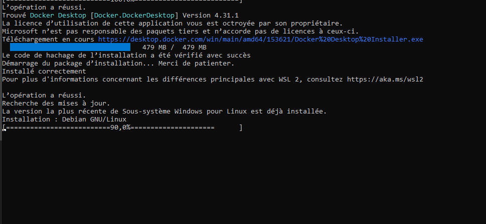

# Skirnir Under Docker 
## On Linux   
1. Install curl and git on your system that's will depend on your OS
2. After installing git and curl, you can run this command  

```bash
git clone https://github.com/Hyldem0er/Skirnir && cd Skirnir/Docker \
sudo chmod +x docker-install.sh && sudo sh docker-install.sh \
sudo docker-compose build \
sudo docker-compose up -d && xhost +local:docker && sudo docker exec -it Skirnir sudo python3 ../Skirnir/main.py --ui
```

### install on debian or ubuntu in one line  
Installation of curl, git and docker building with skirnir launching  
```bash
apt-get install curl git -y \
git clone https://github.com/Hyldem0er/Skirnir && cd Skirnir/Docker \
sudo chmod +x docker-install.sh && sudo sh docker-install.sh \
sudo docker-compose build \
sudo docker-compose up -d && xhost +local:docker && sudo docker exec -it Skirnir sudo python3 ../Skirnir/main.py --ui
```

### Launching Skirnir  
```bash
xhost +local:docker && sudo docker exec -it Skirnir sudo python3 ../Skirnir/main.py --ui
```

## On windows 
#### Powershell with Administrator rights  
```powershell
Invoke-WebRequest -Uri https://raw.githubusercontent.com/Hyldem0er/Skirnir/master/Docker/win-install.ps1 -OutFile .\win-install.ps1
```
```powershell
powershell -noexit -ExecutionPolicy Bypass -File .\win-install.ps1
```
> [!IMPORTANT]
> The script will start and Docker desktop will be launched and after accepting the SLA, this window will appear and you will have the possibility to create an account or not, but you will have to proceed to the next step.  

 

> [!IMPORTANT]
> When you're on your debian under wsl, you'll need to create a user with a password, after which you can run the same one-line command as the debian installation.  
  

> [!IMPORTANT]
>  If you've already performed the installation and rebooted your machine, and you'd like to restart the Skirnir container, you'll need to start docker-desktop and run the docker service in WSL.
```bash
sudo service docker start
```

>[!WARNING]
> You can make the launch permanent by adding docker-desktop to your start menu, but this consumes **a lot of resources**
